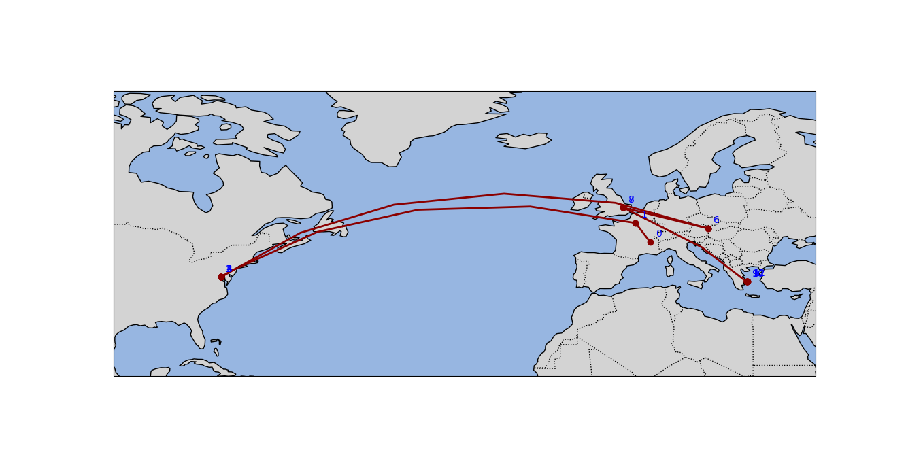

# HopMap

HopMap is a Python tool that visualizes the route that your data takes to get from your machine to a target host or URL. It uses traceroute to find the route, geolocates the IP addresses found in the route, and plots them on a map using Cartopy.

## Installation

1. Clone the repository:
    ```sh
    git clone git@github.com:sellisd/hopmap.git
    ```
2. Navigate to the project directory:
    ```sh
    cd hopmap
    ```
3. Install the requirements:
    ```sh
    pip install .
    ```

## Usage

You can use HopMap from the command line with providing a url address with the `--url` option, or an IPv4 address with the `--host` option:

```shell
hopmap --url www.ntnc.org.np
```

## Screenshots


